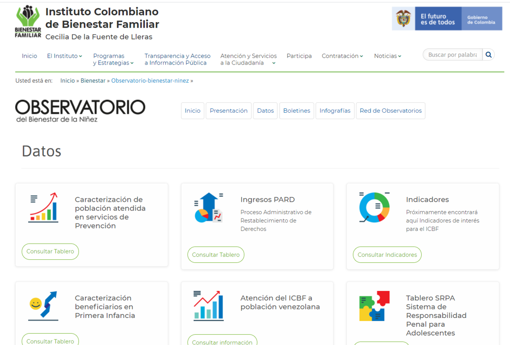

  
  
	<h1>Calidatón y visualizatón de datos abiertos del ICBF</h1>
	 

El objetivo de este taller es transferir conocimientos en herramientas de calidad, análisis y visualización interactiva de datos, que le permita a los participantes del webinar de manera ágil, usable y clara, visibilizar el estado de la apertura, completitud y calidad de datos del Instituto Colombiano de Bienestar Familiar. Durante el taller los participantes tendrán un primer acercamiento a herramientas de software libre como Open Refine, Python, Pandas, Matplotlib, Plotly y Folium.

En este repositorio de GitHub :octocat: encontrará todos los materiales del taller y también recursos adicionales de consulta para profundizar en el uso de las herramientas de software libre.

## Datos abiertos del ICBF
Los datos abiertos son información pública dispuesta en formatos que permiten su uso y reutilización bajo licencia abierta y sin restricciones legales para su aprovechamiento. En Colombia, la Ley 1712 de 2014 sobre Transparencia y Derecho de Acceso a la Información Pública Nacional, define los datos abiertos en el numeral sexto como "todos aquellos datos primarios o sin procesar, que se encuentran en formatos estándar e interoperables que facilitan su acceso y reutilización, los cuales están bajo la custodia de las entidades públicas o privadas que cumplen con funciones públicas y que son puestos a disposición de cualquier ciudadano, de forma libre y sin restricciones, con el fin de que terceros puedan reutilizarlos y crear servicios derivados de los mismos".

**El ICBF dispone de múltiples conjuntos de datos abiertos, los cuales puede consultar [aqui](https://www.datos.gov.co/browse?Informaci%C3%B3n-de-la-Entidad_Nombre-de-la-Entidad=Instituto+Colombiano+de+Bienestar+Familiar) y [aquí](https://www.icbf.gov.co/bienestar/observatorio-bienestar-ninez/datos)**

  
   
   

  
	<h2>Recursos para la limpieza y calidad de datos con Open Refine</h2>

Open Refine es una herramienta que nos permite perfilar y limpiar conjuntos de datos. La limpieza de datos es el proceso que intenta corregir errores de forma semiautomática, eliminando espacios en blanco y duplicados, filtrando y facetando filas, agrupando y transformando valores, dividiendo celdas de múltiples valores, entre otros. Algunas herramientas interesantes para seguir aprendiendo sobre la calidad de datos:

- ¿Cómo asignar más memoria para la limpieza de los datos con Open Refine? [https://escueladedatos.online/guia-de-limpieza-de-datos-con-open-refine/]
- Lecciones de uso de Open Refine [https://librarycarpentry.org/lc-open-refine/]
- Guía para la limpieza de datos sobre biodiversidad con OpenRefine [https://docs.gbif.org/openrefine-guide/3.0/es/]
- Kit de video tutoriales para la descarga, instalación y el uso de las principales funcionalidades de Open Refine [https://gobiernodigital.mintic.gov.co/portal/Iniciativas/Software-libre/]

  
  
	<h2>Recursos para la exploración de datos abiertos con Socrata, Python y Pandas</h2>

- [Manual de usuario](http://herramientas.datos.gov.co/sites/default/files/2020-11/CO_417_MNL_USUARIO_FINAL.pdf) de Datos Abiertos para visualizar conjuntos de datos a partir de Socrata
- [Repositorio](https://github.com/xmunoz/sodapy) de la Socrata Open Data API (SODA API) para Python que permite la conexión con conjuntos de datos
- [Tutorial](https://www.youtube.com/watch?v=4Sxznhabeew) para descargar Datos Abiertos
- Instructivos básicos de Pandas sobre [qué tipos de datos contienen los Dataframes](https://pandas.pydata.org/pandas-docs/stable/getting_started/intro_tutorials/01_table_oriented.html#), [cómo seleccionar subconjuntos de datos](https://pandas.pydata.org/pandas-docs/stable/getting_started/intro_tutorials/03_subset_data.html) y [calcular estadísticas descriptivas](https://pandas.pydata.org/pandas-docs/stable/getting_started/intro_tutorials/06_calculate_statistics.html)

   
  

